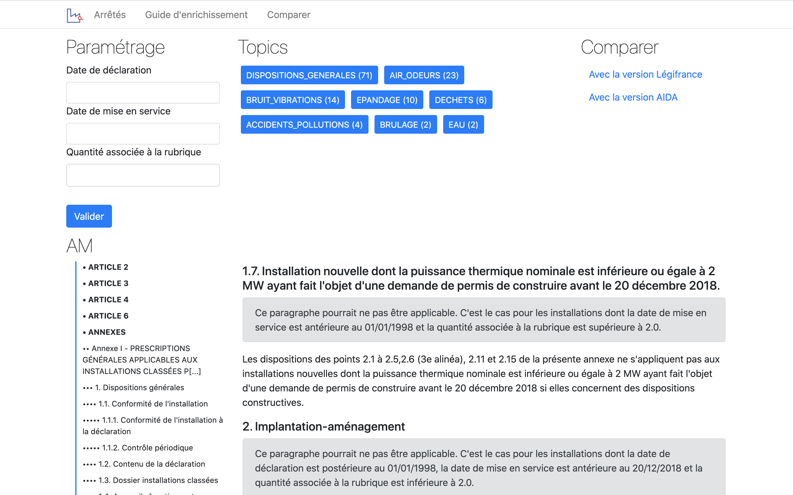

# Envinorma :gb:

(Version Française ci-dessous.)

Envinorma is a project which aims at helping people find applicable regulations to French non-nuclear industries ([ICPE](https://fr.wikipedia.org/wiki/Installation_class%C3%A9e_pour_la_protection_de_l'environnement)).

Read the [project description](https://entrepreneur-interet-general.etalab.gouv.fr/defis/2020/envinorma.html) on the EIG Program website.

This repository is a library for manipulating enriched versions of regulation texts, in particular texts called _Arrêtés Ministériels_ (AM) and _Arrêtés Préfectoraux_ (AP). It consists of three main layers : structuration, parametrization and enrichment.

# Modules

## envinorma/data.py

Data classes, among which `StructuredText`, the proposed structure for representing regulation texts with, compatible with features like parametrization and topic detection.

## envinorma/io

Utils for parsing and generating `StructuredText` instances from/to `.docx` file, `.odt` file, `html`, `markdown`.

## envinorma/structure

A set of functions for automatic detection of text structure, mainly based on title detection.

## envinorma/topics

An ontology and a parser for topic detection in `StructuredTexts`.

## envinorma/parametrization

Module for managing the parametrization layer of `StructuredText` instances.

## envinorma/back_office

Web app for managing the database of AM, manually structuring, parametrization layer declaration and enriching AM.

## envinorma/dashboard

Dash app for ICPE data exploration, deployed here [https://envinorma-dashboard.herokuapp.com/](https://envinorma-dashboard.herokuapp.com/) which gathers statistics on open data about ICPE and this project

## legifrance

A wrapper for [Légifrance API](https://api.gouv.fr/les-api/DILA_api_Legifrance).

# Envinorma :fr:

Envinorma cherche à faciliter la préparation des inspections en simplifiant l'accès à la réglementation applicables aux industries non nucléaires en France (les [ICPE](https://fr.wikipedia.org/wiki/Installation_class%C3%A9e_pour_la_protection_de_l'environnement)).

Ce projet est réalisé dans le cadre du programme EIG, une page d'introduction est accessibile [ici](https://entrepreneur-interet-general.etalab.gouv.fr/defis/2020/envinorma.html).

Ce dépôt est une librairie permettant la manipulation des textes réglementaires, en particulier les _Arrêtés Ministériels_ (AM) et les _Arrêtés Préfectoraux_ (AP). Elle est constituée de trois couches principales : structuration, parametrage et enrichissement.

# Modules

## envinorma/data.py

Module contenant les classes de données, en particulier la classe `StructuredText`, qui constitue la structure proposée pour représenter les textes réglementaires, permettant de représenter une structure suffisamment générale ainsi que le résultat de paramétrages, détection de thèmes et autres métadonnées.

## envinorma/io

Ensemble de modules pour transformer des `StructuredText` en fichier `.docx`, `.odt`, `html` ou `markdown`.

## envinorma/structure

Module de détection automatique de structure d'un texte en se basant sur la détection de titre.

## envinorma/topics

Module de détection de thème dans un `StructuredTexts`.

## envinorma/parametrization

Module de gestion de la couche de parametrage d'un `StructuredText`.

## envinorma/back_office

Application web pour :

- gérer la base des arrêtés ministériels
- modifier manuellement la structure d'un `StructuredText``
- intéragir avec un texte enrichi et paramétré.

## envinorma/dashboard

Application Dash pour explorer les données ouvertes sur les ICPE. Une instance est accessible ici : [https://envinorma-dashboard.herokuapp.com/](https://envinorma-dashboard.herokuapp.com/)

## legifrance

Un module d'intéraction avec l'[API Légifrance](https://api.gouv.fr/les-api/DILA_api_Legifrance)
