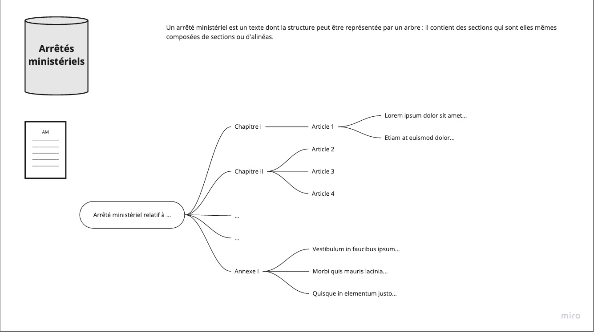

# Models

Les schémas sont décrits dans [la documentation](https://envinorma.github.io/envinorma-data/envinorma.models.html#module-envinorma.models.arrete_ministeriel).

Un arrêté ministériel a une structure récursive, comme représenté ci-dessous.

Un arrêté ministériel peut être paramétré, comme détaillé [ici](../parametrization/README.md).
