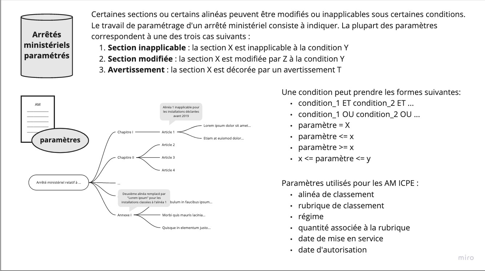
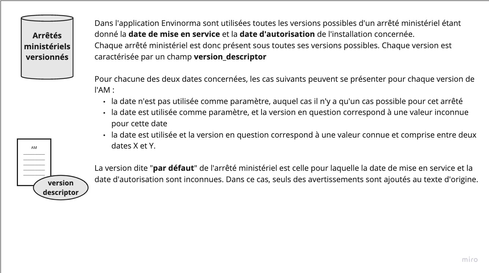
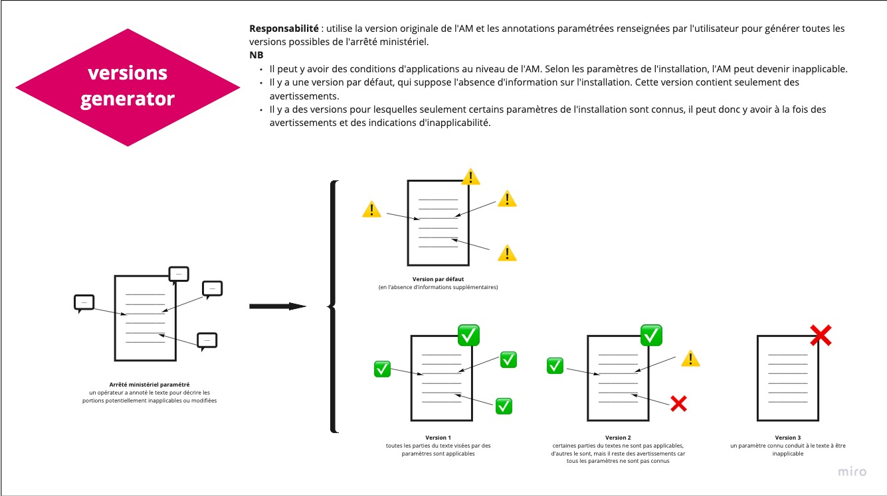

# Parametrization

Un arrêté ministériel peut être paramétré (schéma [Parametrization](https://envinorma.github.io/envinorma-data/envinorma.parametrization.models.html#envinorma.parametrization.models.parametrization.Parametrization)).

À partir d'une _Parametrization_ et d'un _ArreteMinisteriel_, on peut générer toutes les versions possibles d'un arrêté ministériel.

## Versions generator

Pour passer d'un couple (ArreteMinisteriel, Parametrization) à la liste des versions de l'arrêté ministériel, on utilise la fonction [generate_am_with_versions](envinorma.parametrization.html?highlight=generate_am_with_versions#envinorma.parametrization.am_with_versions.generate_am_with_versions), dont le principe est explicité ci dessous:

